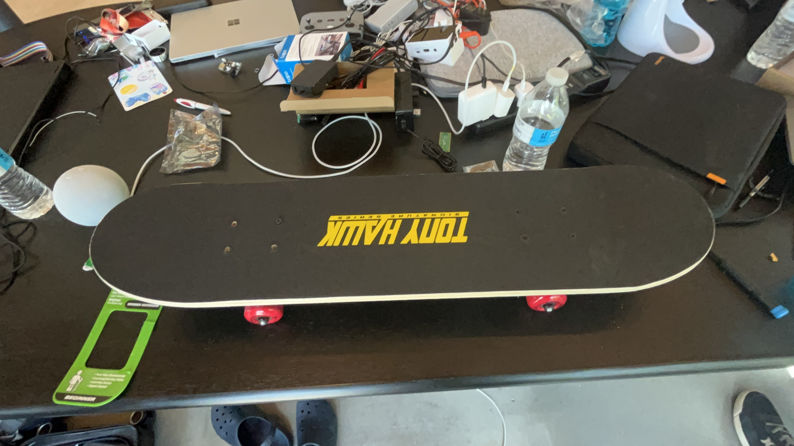

# Klinoboard
STASIS!! 
a hack club project
----
this was built to fix one annoying thing about electric skateboards: the remote.

electric boards usually want you to hold a controller in your hand. that defeats the point of skateboarding, where your feet are what's riding

### Concept

Klinoboard is a lean-controlled electric skateboard. You lean in to give it power, and you lean back to slow it down. No handheld remote required.

- built from a skateboard chassis, a CIM motor, a custom rear axle and some willpower
- uses NFC for rider authentication and timed unlocks (what we ended up using as our stash item)
- uses an ESP32 for logic, pedal sensing and motor PWM control (this doesnt really work) 

### How it works

1. Scan a Stasis NFC tag to unlock the board.
2. Lean forward to add power.
3. Step off to stop. (no brake...)
4. When time runs out, the motor shuts off automatically.

_landscape.jpg)

## etc

For the full parts list and hardware details see `item-list.md`.

For the CAD files look into `\cad\`

For the code take a look at `Code.py`